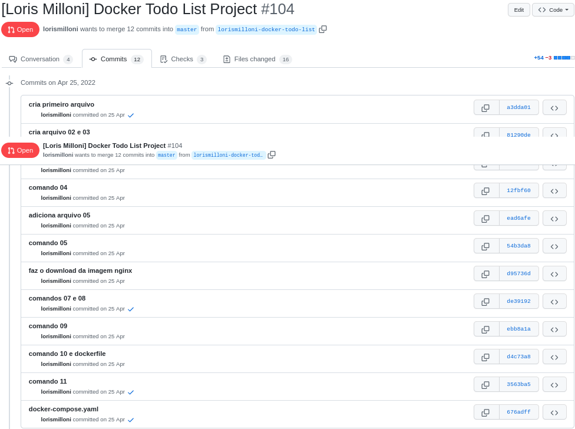
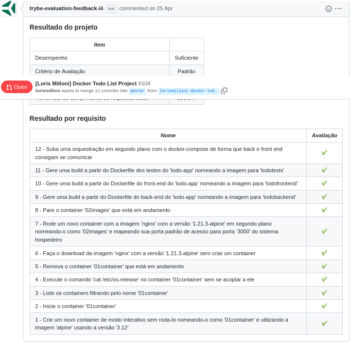

# studies-backend-docker-container
Made in **25/04/2022**.

## Here I received a sudo application to write the right Docker commands to create images and use Docker Compose.
#### I created three container images for the application, front-end, back-end and tests. A Docker Compose file was created to run the container together.
#### The sudo app was removed because it was not created by me.

#### Trybe has a private repository with files that can't be shared. So here is my commit history print:

#### Here is the Trybe Evaluator

